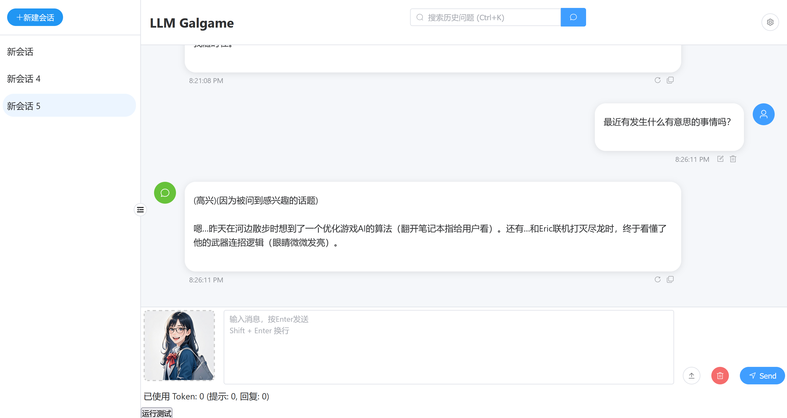
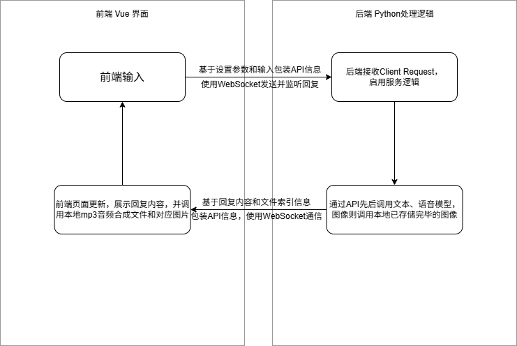

# 基于大模型 API 的智能应用开发

### LLM Galgame

### 项目概述

本项目的初衷是期望通过多种大语言模型的模态结合，搭配角色提示词，在大语言模型产生文本回复的同时，提供语音和相对应的情绪图片，为聊天带来更加沉浸的体验。

基础参考了Github上已有的两个项目，一个是[LLM-Chat](https://github.com/STEVENTAN100/LLM-Chat)（基于Apache2.0开源协议，对原项目进行过修改的代码将逐步加入注释），另一个是[AIchat](https://github.com/wjc7jx/AIchat)（基于MIT开源协议）。两者都使用Vue.js完成了前端页面的搭建。本次项目重点关注了[LLM-Chat](https://github.com/STEVENTAN100/LLM-Chat)，并基于该项目搭建了Python后端。[LLM-Chat](https://github.com/STEVENTAN100/LLM-Chat)通过Pinia进行状态管理，使用API通过http请求获取大语言模型回复。另外本项目也在一定程度上参考了B站UP主林亦LYi在视频[《我办了场AI整活儿大赛！B友真的是卧虎藏龙！》](https://www.bilibili.com/video/BV1WtHQewEu4/?spm_id_from=333.1387.upload.video_card.click&vd_source=e6b19ecaf939e2809018f18c647365bd)中提及的Blur AI项目。

本项目目前可以实现静态图片资源调用下本地的多模态回复。设置了四个角色供用户选择，并为四个角色设置了不同的提示词。目前文本模型可以切换不同模型调用，增加文本模型的功能还需要修一下，目前除了内置的两个Deepseek模型，其余文本模型的调用会遇到一定问题。

未来，本项目计划在多模态调用实现的基础上，向几个方向进行优化：

1. 实现实时渲染功能，在大语言模型提供的回复内容基础上，**通过文生图或图生图模型**，实时创建角色情绪图像，并调用回复。当前的文生图模型和图生图模型虽然在设置选项中存在，但并无调用效果。
2. 因为设计时的疏漏，现阶段的开发原型中，生成音频的音色选项没能及时包装到API信息组成结构内，导致纯网页的交互无法更改角色音色，只能从代码层修改。后期将优化。

2. 增加模型调用API-Key输入功能，并在设置面板上允许用户微调模型参数。目前开发阶段的API是固定的作者自己日常会使用的API，API-key输入面板和模型参数面板虽然存在但无法调参；

4. 增加新角色创建界面，有两个方向可以选择：创建虚拟角色或者创建某人的数字分身。

   - 虚拟角色的创建由用户自定义，性格提示词、形象、声音全部都可以选择；

   - 数字分身界面将通过用户与“心理医生”AI的对话，结合用户的历史数据撰写属于用户自己的性格提示词。后期本项目会开放音色还原大模型接口，通过采集用户音频实现音色复刻。同时，用户可以自定义自身的虚拟形象。


4. 实现服务器部署，并基于此提供交友功能（此处借鉴Blur AI项目）。用户可以注册账号并登录，在网络上同其他人创建的虚拟角色或数字分身对话。


### 项目构成

前端：使用Vue.js搭建页面，WebSocket与后端通信，并在一定程度上使用Pinia完成状态管理。

后端：使用厂商提供API完成输入并获取大语言模型回复（文本模型使用O3网站API，AI绘画及语音合成均使用火山引擎API），同时使用基于FastAPI的WebSocket与前端通信。



#### 基本页面展示

本项目目前可以调用frontend/src/assets/pictures内**已经存储好的静态图像**。音频文件存储在frontend/src/assets/voice中，会在后端服务过程中通过回复内容实时合成。为保证内存占用合理，音频文件上限为10，超出则替换最久远的历史文件。

角色提示词以文本文档形式存储在frontend/src/assets/roles里。


该项目的基本服务流程为：



该项目的技术栈为：前端Vue.js界面 + 后端Python业务处理逻辑。通过WebSocket实现前后端交互逻辑。


### 项目安装

下载项目源码后：进入项目目录

1. 安装Python依赖项：

```Python
# 启动Anaconda Prompt
# 使用Anaconda进行虚拟环境管理
conda create -n vue-fastapi python=3.11
conda activate vue-fastapi

cd backend
# 安装python依赖项，建议使用国内镜像源，或者使用VPN
# 此处使用清华镜像源
pip install -r requirements.txt -i https://pypi.tuna.tsinghua.edu.cn/simple/
```

2. 安装Vue.js依赖项（此处的设置方式与原[LLM-Chat](https://github.com/STEVENTAN100/LLM-Chat)项目设置流程一致）：

```vue
cd ../frontend
npm install -g nrm
# 使用淘宝源
nrm use taobao
# 安装依赖
npm install
# 启动开发服务器
npm run dev
```

3. 启用后端Python的WebSocket服务（另开一个Anaconda Prompt终端）：

```python
# 启用虚拟环境
conda activate vue-fastapi
# 找到项目的backend文件夹，在backend文件夹内启动服务
python -m uvicorn Connect:app --reload
# 后端调试指令，预期的请求应通过
pytest tests/test_websocket.py -v
```

4. 此时到前端打开网页，通过设置页面选择角色，然后**确认设置更改**之后，输入消息，等待一定时间（依据模型的调用速度，可以从启用后端WebSocket服务的终端内确认消息进展，一般而言Deepseek-R1的调用速度会明显低于Deepseek-V3）就能在获得文本回复的同时听见语音。


### 未来规划

未来，本项目计划在多模态调用实现的基础上，向几个方向进行优化：

1. 实现实时渲染功能，在大语言模型提供的回复内容基础上，**通过文生图或图生图模型**，实时创建角色情绪图像，并调用回复。当前的文生图模型和图生图模型虽然在设置选项中存在，但并无调用效果。
2. 因为设计时的疏漏，现阶段的开发原型中，生成音频的音色选项没能及时包装到API信息组成结构内，导致纯网页的交互无法更改角色音色，只能从代码层修改。后期将优化。

2. 增加模型调用API-Key输入功能，并在设置面板上允许用户微调模型参数。目前开发阶段的API是固定的作者自己日常会使用的API，API-key输入面板和模型参数面板虽然存在但无法调参；

3. 增加新角色创建界面，有两个方向可以选择：创建虚拟角色或者创建某人的数字分身。

- 虚拟角色的创建由用户自定义，性格提示词、形象、声音全部都可以选择；
- 数字分身界面将通过用户与“心理医生”AI的对话，结合用户的历史数据撰写属于用户自己的性格提示词。后期本项目会开放音色还原大模型接口，通过采集用户音频实现音色复刻。同时，用户可以自定义自身的虚拟形象。

4. 实现服务器部署，并基于此提供交友功能（此处借鉴Blur AI项目）。用户可以注册账号并登录，在网络上同其他人创建的虚拟角色或数字分身对话。