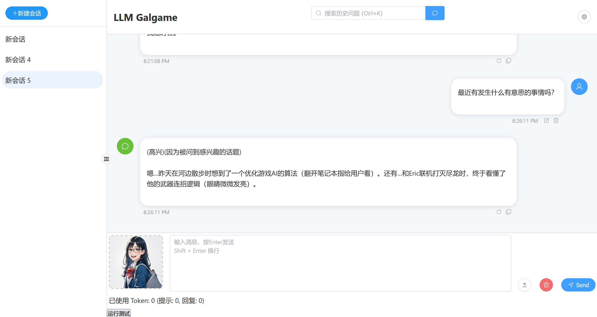
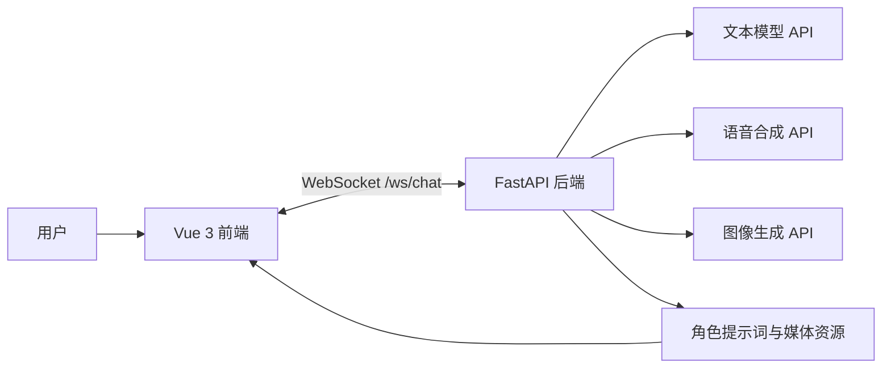

# LLMGal

LLMGal 是一个基于大语言模型 API 的多模态角色聊天原型。用户可以选择角色、文本模型、音色和图像模式；系统生成角色化文本回复，并配套合成语音与情绪图片，提供更具沉浸感的对话体验。

> 项目目前处于开发原型阶段，适合作为软件测试与质量保证课程的被测对象，不建议直接用于生产环境。



## 核心功能

- 四个预置角色及独立角色提示词
- 基于 WebSocket 的前后端双向通信
- 可切换的文本模型、音色与图像生成模式
- 从回复中提取情绪并匹配角色图片
- 实时语音合成与本地音频缓存
- 静态情绪图片与实时图像生成两种路径

## 系统架构


```mermaid
flowchart LR
    U[用户] --> F[Vue 3 前端]
    F <-->|WebSocket /ws/chat| B[FastAPI 后端]
    B --> L[文本模型 API]
    B --> T[语音合成 API]
    B --> I[图像生成 API]
    B --> A[角色提示词与媒体资源]
    A --> F
```

前端使用 Vue 3、TypeScript、Vite、Pinia 和 Element Plus；后端使用 Python、FastAPI 和 WebSocket，并通过 OpenAI 兼容接口与火山引擎相关服务完成文本、语音和图像处理。

## 项目结构

```text
LLMGal/
├── backend/
│   ├── Connect.py          # FastAPI 应用、健康检查和 WebSocket 入口
│   ├── Integration.py      # 文本、语音、图像处理流程编排
│   ├── Text.py             # 角色提示词读取与文本模型调用
│   ├── Voice.py            # 语音合成与音频保存
│   ├── Image.py            # 情绪图片选择与图像生成
│   ├── test_websocket.py   # WebSocket 端到端测试
│   ├── pytest.ini          # pytest 配置
│   └── requirements.txt    # Python 依赖
├── frontend/
│   ├── src/components/     # 页面组件
│   ├── src/views/          # 聊天主视图
│   ├── src/stores/         # Pinia 状态管理
│   ├── src/utils/          # API、WebSocket 与消息处理工具
│   ├── src/assets/         # 角色提示词、图片、语音和样式
│   ├── src/_tests_/        # Vitest 测试
│   └── package.json        # 前端依赖与脚本
├── WebPage_Image.png       # 页面截图
├── Vue-FastAPI.png         # 服务流程图
└── README.md
```

## 环境要求

- Python 3.11
- Node.js 18 或更高版本
- npm 9 或更高版本
- 可访问所配置文本、语音和图像服务的网络环境

## 配置说明

完整多模态流程依赖三类第三方服务：OpenAI 兼容的文本模型接口、火山引擎图像服务和语音合成服务。当前原型的服务配置仍分散在 `backend/Text.py`、`backend/Image.py` 和 `backend/Voice.py` 中。

使用前请完成以下工作：

1. 为三类服务准备仅用于开发或测试的凭据。
2. 将配置改为从环境变量或本地 `.env` 文件读取。
3. 确保 `.env` 已被 Git 忽略，禁止提交真实密钥。
4. 对曾经提交到仓库的凭据立即作废并重新生成。

前端设置面板中的 API Key 仅供前端直连接口相关功能使用，不能替代后端所需配置。

## 快速开始

### 1. 启动后端

在仓库根目录执行：

```bash
cd backend
python3.11 -m venv .venv
source .venv/bin/activate          # Windows: .venv\Scripts\activate
python -m pip install -r requirements.txt
python -m uvicorn Connect:app --reload --host 127.0.0.1 --port 8000
```

后端必须从 `backend` 目录启动，因为当前代码使用了相对于该目录的资源路径。浏览器访问 <http://127.0.0.1:8000/>，返回 `{"status":"alive"}` 表示服务已启动。

### 2. 启动前端

打开另一个终端：

```bash
cd frontend
npm ci
npm run dev
```

按终端显示的地址打开页面。前端默认连接 `ws://localhost:8000/ws/chat`；选择角色并保存设置后即可发起对话。

## 测试与质量检查

### 模块一：隔离自动化测试

模块一测试工程位于以下路径：

```text
LLMGal/
├── backend/
│   ├── tests/
│   │   ├── conftest.py                      # 公共 Mock、Stub 和网络阻断配置
│   │   ├── test_websocket_cases.py          # WebSocket、配置、异常和 ACK 测试（14 条）
│   │   └── test_service_and_state_cases.py  # 文本、语音、图片和资源状态测试（20 条）
│   └── requirements-test.txt                # 独立测试依赖
├── scripts/
│   └── run_module1_tests.sh                 # 一键运行全部 34 条用例
└── docs/module1/
    └── LLMGal_backend_34_test_cases.md       # 34 条测试用例清单
```

真正执行 34 条测试用例的代码集中在 `backend/tests/`：

- [`backend/tests/test_websocket_cases.py`](backend/tests/test_websocket_cases.py)：包含 14 条 WebSocket 消息、嵌套配置、断线和 ACK 协议测试。
- [`backend/tests/test_service_and_state_cases.py`](backend/tests/test_service_and_state_cases.py)：包含 20 条文本、语音、图片、资源索引、异常和并发状态测试。
- [`backend/tests/conftest.py`](backend/tests/conftest.py)：由 pytest 自动加载，为上述测试提供公共导入配置、第三方 SDK Stub 和真实网络阻断，不单独计算为测试用例。

测试函数名直接包含清单编号。例如，清单中的 `TC-WS-01` 对应 `test_tc_ws_01_valid_static_request_full_flow`，可以据此从用例清单定位到具体代码。

在仓库根目录执行以下命令，即可自动创建 Python 3.11 虚拟环境、安装精简测试依赖并运行全部 34 个后端单元测试：

```bash
./scripts/run_module1_tests.sh
```

如需显示每条用例名称：

```bash
./scripts/run_module1_tests.sh -v
```

34 个测试函数与 [`docs/module1/LLMGal_backend_34_test_cases.md`](docs/module1/LLMGal_backend_34_test_cases.md) 中的用例编号一一对应，覆盖配置映射、情绪解析、资源索引边界、静态与实时图像分支、文本提示词、语音保存、HTTP 请求结构、健康检查及 WebSocket 错误协议。文本模型、语音和图像相关依赖均使用固定 Mock/Stub；测试夹具会阻断遗漏的真实 HTTP 与 WebSocket 调用，因此不需要 API Key，不会调用真实大模型或产生第三方服务费用。

当前原始源码的基线结果为 `32 passed, 2 xfailed`。两条预期失败分别为 `TC-TTS-04`（非法 Base64 会产生零字节音频）和 `TC-EX-02`（非数字索引在清单预期的处理阶段之前即匹配失败）。`xfail(strict=True)` 用于稳定复现并保留缺陷证据；修复后如果行为改变，测试会以 XPASS 使脚本失败，提醒更新缺陷验证结果。

执行结果保存在：

- `artifacts/test-results/pytest-output.txt`：终端执行日志与覆盖率摘要
- `artifacts/test-results/module1-junit.xml`：可供持续集成或报告工具读取的 JUnit 结果

如果 Python 3.11 的命令名称不同，可以显式指定解释器：

```bash
LLMGAL_TEST_PYTHON=/path/to/python3.11 ./scripts/run_module1_tests.sh
```

### 前端测试

```bash
cd frontend
npm ci
npm test -- --run
```

生成覆盖率报告：

```bash
npm run test:coverage -- --run
```

### 后端 WebSocket 端到端测试

先按“快速开始”启动后端，再在另一个已激活虚拟环境的终端执行：

```bash
cd backend
python -m pytest test_websocket.py -v
```

该测试会调用真实的文本、语音和图像服务，需要有效测试凭据和网络连接，可能产生调用费用。它不属于隔离的单元测试。

前端测试和原有后端端到端测试可在后端已启动时依次执行：

```bash
(cd frontend && npm test -- --run) && (cd backend && python -m pytest test_websocket.py -v)
```

其他质量检查：

```bash
cd frontend
npm run lint
npm run build
```

## 当前状态与推荐被测范围

当前包含 34 个与模块一用例清单对应、使用固定 Mock/Stub 的后端隔离单元测试，一个前端基础冒烟测试，以及一个依赖真实外部服务的后端 WebSocket 端到端测试。隔离单元测试可一键执行；端到端测试仍需预先启动服务并配置外部凭据。现有代码仍有 TypeScript 构建、Lint、平台依赖、相对路径和凭据管理问题，需要逐步定位、记录并修复。

建议优先覆盖：

- WebSocket 消息格式、异常输入、断线重连和 ACK 超时
- 角色提示词读取、缺失文件和非法角色名
- 七类情绪的提取、默认回退和图片映射
- 图片与音频索引在 `0` 到 `9` 之间的轮换边界
- 实时图像生成失败后的静态资源回退
- 第三方接口超时、限流、无效凭据和异常响应
- 前端设置持久化、消息编辑、停止生成和状态同步

## 已知限制

- 第三方服务配置尚未统一迁移到环境变量。
- 实时图像生成、部分模型切换和音色配置仍不完整。
- 原有的 `backend/test_websocket.py` 仍依赖真实外部服务；课程单元测试已通过 Mock/Stub 隔离。
- 当前前端 `build` 与 `lint` 存在待修复问题。
- 仓库仍包含部分历史开发期生成文件；根目录 `.gitignore` 已覆盖新的测试缓存和结果文件。

## 项目来源与许可

前端主要参考 [LLM-Chat](https://github.com/STEVENTAN100/LLM-Chat) 和 [AIchat](https://github.com/wjc7jx/AIchat)，并在此基础上增加 Python 后端与多模态处理流程。详细许可信息见 [LICENSE](LICENSE)。
