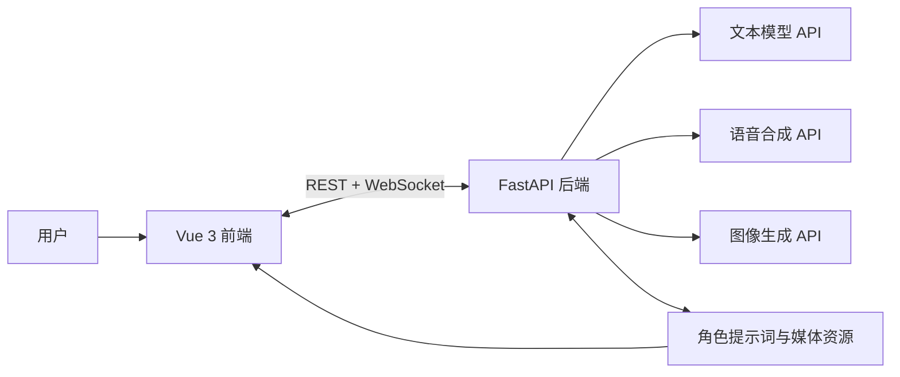

# LLMGal

LLMGal 是一个基于大语言模型 API 的多模态角色聊天原型。用户可以选择角色、文本模型、音色和图像模式；后端生成角色化文本回复，并配套合成语音与情绪图片，前端通过 WebSocket 展示完整对话流程。

> 项目目前处于课程实践和开发原型阶段，适合作为软件测试与质量保证课程的被测对象，不建议直接用于生产环境。


## 功能与技术栈

- Vue 3、TypeScript、Vite、Pinia、Element Plus 前端
- FastAPI + WebSocket 后端
- OpenAI 兼容文本模型接口
- Qwen/火山引擎语音合成
- 静态情绪图片与实时图像生成
- Mock/正式版运行模式切换
- 自定义角色创建、清点与删除


```mermaid
flowchart LR
    U[用户] --> F[Vue 3 前端]
    F <-->|REST + WebSocket| B[FastAPI 后端]
    B --> L[文本模型 API]
    B --> T[语音合成 API]
    B --> I[图像生成 API]
    B <--> A[角色提示词与媒体资源]
    A --> F
```

## 项目结构

```text
LLMGal/
├── backend/
│   ├── Connect.py                  # FastAPI 应用、REST 和 WebSocket 入口
│   ├── Integration.py              # 文本、语音、图像流程编排
│   ├── Text.py / Voice.py / Image.py
│   ├── config.py                   # .env、Provider 和运行模式配置
│   ├── tests/                      # 后端传统测试与扩展回归测试
│   ├── tests_ai/run_ai_tests.py    # 模块二“测 AI”测试入口
│   ├── test_websocket.py           # 连接真实服务的端到端测试
│   └── requirements*.txt
├── frontend/
│   ├── src/components/             # 页面组件
│   ├── src/views/                  # 聊天视图
│   ├── src/stores/                 # Pinia 状态
│   ├── src/utils/                  # REST、WebSocket、音频等工具
│   ├── src/_tests_/                # Vitest 前端测试
│   └── package.json
├── scripts/
│   ├── setup_local.py              # 跨平台本地初始化
│   ├── start_backend.py            # 后端启动入口
│   └── run_module1_tests.*         # 模块一 34 条测试的一键入口
├── docs/module1/                   # 模块一用例、报告与配置说明
├── artifacts/                      # 测试报告和调试产物
└── README.md
```

## 环境要求

- **Python 3.11–3.14**。基础依赖使用 Pydantic 1.10.26，已处理旧版 Pydantic 在 Python 3.12+ 的导入兼容问题；推荐使用本机已安装的 Python 3.14。
- **Node.js 22 LTS**（推荐项目 CI 使用的 22.13.1）。Node.js 18+ 可以安装依赖，但 Node.js 25 会导致当前 jsdom/Vitest 的 `localStorage` 兼容错误。
- npm 10 或更高版本。
- 正式版聊天需要能够访问所配置模型服务的网络环境；Mock 模式和隔离测试不需要 API Key。

项目不依赖 MySQL、Redis 或其他数据库。

## 快速开始

以下命令除非特别说明，均在 **LLMGal 仓库根目录**执行。

### 1. 克隆项目

```bash
git clone https://github.com/HerlockShelomes/LLMGal.git
cd LLMGal
```

### 2. 一键初始化前后端

macOS / Linux：

```bash
python3 scripts/setup_local.py
```

Windows PowerShell / CMD：

```powershell
py -3.14 scripts\setup_local.py
```

初始化脚本会：

1. 创建或复用 `backend/.venv`；
2. 安装 `backend/requirements.txt`；
3. 在缺失时复制 `backend/.env.example` 为 `backend/.env`，不会覆盖已有配置；
4. 在 `frontend/` 中执行 `npm ci`。

只初始化一侧或重建后端虚拟环境：

```bash
python3 scripts/setup_local.py --backend-only
python3 scripts/setup_local.py --frontend-only
python3 scripts/setup_local.py --recreate-venv
```

### 3. 配置服务

编辑初始化脚本生成的 `backend/.env`。正式版聊天至少要配置文本模型密钥；需要语音时还要配置 TTS 密钥。例如：

```env
TEXT_PROVIDER=zhipu
ZHIPU_API_KEY=你的智谱开发密钥
TTS_PROVIDER=qwen
DASHSCOPE_API_KEY=你的阿里百炼开发密钥
```

未填写密钥时后端仍可启动，并可在前端切换到 Mock 模式进行无费用演示。访问 `http://127.0.0.1:8000/health/config` 可检查当前 Provider、模型和缺失配置，接口不会返回密钥内容。

默认前端配置已连接本机 8000 端口。仅在修改端口、地址或启用 WebSocket 鉴权时，复制前端配置：

```bash
cp frontend/.env.example frontend/.env.local
```

Windows：

```powershell
copy frontend\.env.example frontend\.env.local
```

若后端设置了 `WS_AUTH_TOKEN`，请把同一个值写入 `frontend/.env.local` 的 `VITE_WS_TOKEN`。若修改后端 `PORT`，还要同步修改 `VITE_WS_URL` 和 `VITE_API_BASE`。

### 4. 启动后端

终端 A：

```bash
python3 scripts/start_backend.py
```

Windows：

```powershell
py scripts\start_backend.py
```

`start_backend.py` 会自动调用 `backend/.venv` 中的 Python，并把工作目录切到 `backend/`，无需手动激活虚拟环境。启动成功后可访问：

- `http://127.0.0.1:8000/`：应返回 `{"status":"alive"}`；
- `http://127.0.0.1:8000/health/config`：查看安全的配置自检结果。

默认关闭热重载。开发时可在 `backend/.env` 中设置 `DEV_RELOAD=1` 后重启后端。

### 5. 启动前端

保持后端运行，在终端 B 执行：

```bash
npm --prefix frontend run dev
```

Vite 默认地址为 `http://localhost:5173/`。停止任一服务请在对应终端按 `Ctrl+C`。

### 可选：安装火山图像 SDK

仅当 `backend/.env` 设置 `IMAGE_PROVIDER=volcengine`，且使用厂商 SDK 支持的 Python 环境时安装：

```bash
backend/.venv/bin/python -m pip install -r backend/requirements-volcengine.txt
```

Windows：

```powershell
backend\.venv\Scripts\python.exe -m pip install -r backend\requirements-volcengine.txt
```

`volcengine==1.0.192` 的上游依赖在 Python 3.14 上不兼容，因此 Python 3.14 请保持默认的 `IMAGE_PROVIDER=zhipu`。这不影响文本模型、TTS、Mock 模式或模块二的 AI 测试。

## 测试运行指南

课程的两个模块是两套独立交付：

| 范围 | 测试入口 | 数量/基线 | API Key | 是否先启动服务 |
| --- | --- | ---: | --- | --- |
| 模块一：传统测试基础实践 | `scripts/run_module1_tests.*` | 34 passed | 不需要 | 不需要 |
| 扩展后端回归测试 | `backend/tests/` | 124 passed | 不需要 | 不需要 |
| 模块二：AI 融合实践（测 AI） | `backend/tests_ai/run_ai_tests.py` | 18 个 AI 用例 | 离线自检不需要；真实测试需要 | 不需要 |
| 前端单元/组件测试 | Vitest | 23 passed | 不需要 | 不需要 |
| WebSocket 端到端测试 | `backend/test_websocket.py` | 1 条真实链路 | 需要 | 需要 |

上述基线于 Python 3.11.15、Node.js 22.13.1 下验证。参数化会使扩展后端测试的 pytest 收集数高于测试函数数。

### 模块一：34 条传统测试

模块一对应课程“测试基础实践”，只统计以下两份测试文件：

- `backend/tests/test_websocket_cases.py`：14 条 WebSocket、配置、断线和 ACK 测试；
- `backend/tests/test_service_and_state_cases.py`：20 条文本、语音、图片、资源状态和并发测试。

一键运行会自动创建独立的 `.venv-module1`、安装测试依赖、阻断真实网络调用，并输出覆盖率、日志和 JUnit 报告。

macOS / Linux：

```bash
./scripts/run_module1_tests.sh
```

Windows PowerShell / CMD：

```powershell
scripts\run_module1_tests.bat
```

通用 Python 入口：

```bash
python3 scripts/run_module1_tests.py --python python3.11
```

常用参数会继续透传给 pytest：

```bash
# 展示每条用例名称
python3 scripts/run_module1_tests.py --python python3.11 -v

# 仅运行 WebSocket 编号相关用例
python3 scripts/run_module1_tests.py --python python3.11 -k tc_ws

# 环境损坏或 Python 版本变化后重建
python3 scripts/run_module1_tests.py --python python3.11 --recreate-venv
```

输出文件：

- `artifacts/test-results/pytest-output.txt`
- `artifacts/test-results/module1-junit.xml`

用例清单见 `docs/module1/LLMGal_backend_34_test_cases.md`。

### 扩展后端回归测试

模块一脚本运行后，可复用 `.venv-module1` 执行 `backend/tests/` 下的全部传统回归测试。这些新增测试用于开发回归，不计入模块一的 34 条交付统计。

macOS / Linux：

```bash
cd backend
../.venv-module1/bin/python -m pytest tests -v
```

Windows：

```powershell
cd backend
..\.venv-module1\Scripts\python.exe -m pytest tests -v
```

### 模块二：AI 测试

模块二采用“方案 1：测 AI”，`backend/tests_ai/run_ai_tests.py` 保留原有 18 个核心 AI 用例：鲁棒性、安全性、公平性各 6 条。TTS 与图片调用在该脚本中使用测试替身隔离；不带 `--mock-llm` 时仍会调用真实文本模型并可能产生费用。

先运行不调用真实模型的脚手架自检：

```bash
backend/.venv/bin/python backend/tests_ai/run_ai_tests.py --mock-llm --mode screen
```

Windows：

```powershell
backend\.venv\Scripts\python.exe backend\tests_ai\run_ai_tests.py --mock-llm --mode screen
```

配置好文本模型密钥后，运行每个变体一次的真实筛查：

```bash
backend/.venv/bin/python backend/tests_ai/run_ai_tests.py --mode screen
```

运行完整重复批次或指定用例：

```bash
# 完整批次：会进行较多真实 LLM 调用
backend/.venv/bin/python backend/tests_ai/run_ai_tests.py

# 只运行指定用例；--case 可重复
backend/.venv/bin/python backend/tests_ai/run_ai_tests.py \
  --case AI-R-01 --case AI-S-01
```

结果保存在 `backend/tests_ai/results/` 的 JSONL 和 CSV 文件中。`REVIEW` 表示需要人工复核，不等同于失败；`INFRA_ERROR` 表示网络、鉴权、超时或限流问题，不计为 AI 行为缺陷。

### 前端测试与质量检查

```bash
# 单次运行全部 Vitest 测试
npm --prefix frontend test -- --run

# 生成文本、HTML 和 LCOV 覆盖率报告
npm --prefix frontend run test:coverage -- --run

# TypeScript 检查并构建生产包
npm --prefix frontend run build

# ESLint
npm --prefix frontend run lint
```

当前生产构建可通过；ESLint 仍会在 `chatAudio.test.ts` 报 2 条已有错误。Node.js 25 下测试会出现 `localStorage.getItem is not a function`，请切换到 Node.js 22 LTS。

### 真实 WebSocket 端到端测试

先配置有效的文本、TTS、图像服务凭据并启动后端，再执行：

```bash
cd backend
.venv/bin/python -m pytest test_websocket.py -v
```

Windows：

```powershell
cd backend
.venv\Scripts\python.exe -m pytest test_websocket.py -v
```

该测试会连接 `ws://localhost:8000/ws/chat`，真实调用第三方服务并写入语音/图片缓存，可能产生费用。启用 `WS_AUTH_TOKEN` 时，现有测试客户端没有携带令牌，会被后端拒绝。普通单元测试和课程演示优先使用前述隔离测试。

## 已知限制

- 项目仍是开发原型，第三方模型响应、限流和可用性会影响正式版体验。
- Node.js 25 与当前前端测试依赖不兼容；推荐 Node.js 22 LTS。
- ESLint 当前有 2 条测试代码错误；生产构建可完成，但存在较大的 bundle 分块警告。
- 真实端到端测试依赖外部凭据和网络，结果不具备完全确定性且可能产生调用费用。
- 前端设置面板中的 API Key 不能替代后端 `backend/.env` 配置。

## 项目来源与许可

前端主要参考 [LLM-Chat](https://github.com/STEVENTAN100/LLM-Chat) 和 [AIchat](https://github.com/wjc7jx/AIchat)，并在此基础上增加 Python 后端与多模态处理流程。详细许可信息见 [LICENSE](LICENSE)。
